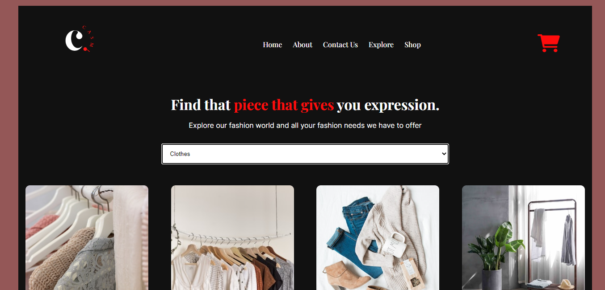
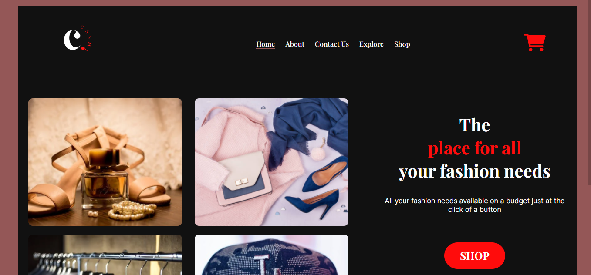

## Casmi Store

Casmi store is a fashion store e-commerce project built for the ALX software engineering portfolio project task.

### Introduction

The Minimum Viable Product(MVP) of this project is to ensure that users have access to a variety of fashion items and at a discounted price this we have ensured with the explore page. Each option request call on the explore page is used as placeholder for possible fashion vendors users can scroll through to find the one that best suit their need and accomodates their budget.

## Resources

[Unsplash](https://unsplash.com)

## APIs

* Unsplash photo API
* Google Translate API

## Screenshots

## Links

[Live Site](https://khemmie-ray.github.io/Casmi-Store/index.html) 

[Wireframes](https://www.canva.com/design/DAFUGHF16Ns/b6J1N8Fm9Hschv9RhsDUmA/view?utm_content=DAFUGHF16Ns&utm_campaign=designshare&utm_medium=link2&utm_source=sharebutton)

[Design](https://www.figma.com/file/GdK1dhOJ97V2eNcIUzvDkX/Casmi-ecommerce-site?node-id=1%3A2&t=3S75cGF7jizNpThr-1)

## Usage

To use this project, it can be cloned by using the *git clone* command. Afterwards the user can make changes according to their needs.

## Contribute

We are open to contributions, improvements and constructive feedbacks.

## Authors 

* Atoyebi Oluwakemi

Roles

Creating the UI and responsive design of the project. Frontend developer -integrating the APIs on the website and setting up the shopping features.

* Ehigie Paul

Role

Frontend developer - styling and building the home, contact and about page.
